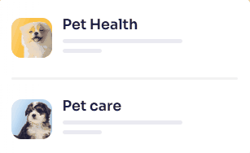
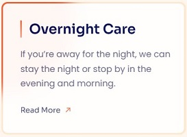

# 🌟 Lucy Pet Care — Landing Page

A fully responsive landing page for a fictional pet care service.  
Built from scratch using **HTML5** and **CSS3**, with custom animations and accessibility-ready design.

## 🎨 Features

-   **Fully responsive** design with 4 breakpoints (mobile → desktop)
-   **Pure CSS animations** (skeleton loading, blob animated border, animated border, flip card, auto-carousel, floating label, tooltip hover)
-   **Drawer-style navigation** built without JS
-   **Accessible & semantic** HTML5 structure
-   **Optimized assets** + **SEO** meta tags, and social preview metadata (Facebook, Zalo, LinkedIn, etc.)
-   **BEM**-based modular CSS architecture

## ✨ Animation Highlights

Here are key UI/UX animations crafted for this project:

| Animation                | Description                                    | Demo                                              |
| ------------------------ | ---------------------------------------------- | ------------------------------------------------- |
| **Skeleton loading**     | Placeholder shimmer while content loads        |  |
| **Floating label**       | Input labels float smoothly on focus           |       |
| **Tooltip hover**        | Subtle tooltip reveal with fade/slide motion   |            |
| **Flip card**            | 3D flip transition on hover                    |             |
| **Blob animated border** | Animated blob background following border path |                  |

> Note: A combined preview GIF is included below for a quick overview.

Includes additional custom effects such as **animated border highlight** and other subtle UI micro-interactions.  
To see these and the full interactive experience (auto-carousel, scroll effects via AOS, and more), visit the [Live Demo](https://vidiccc.github.io/htmlcss-project-04/)

## 📄 Author

Developed by [Vidic](https://github.com/Vidiccc)
